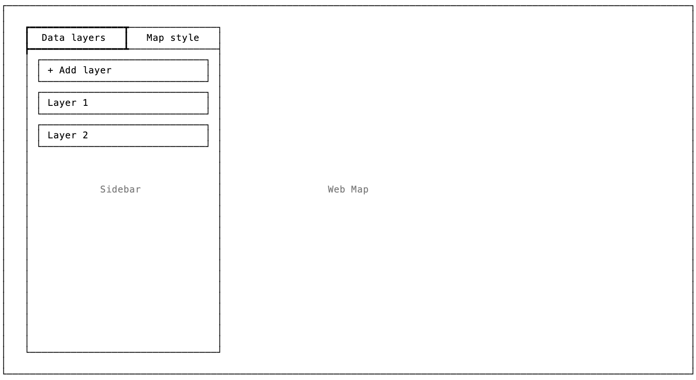
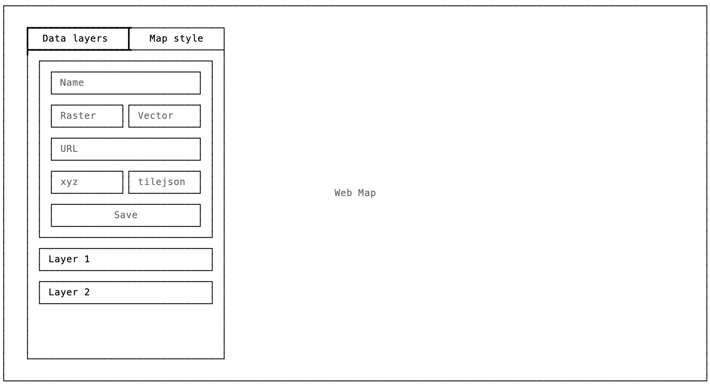
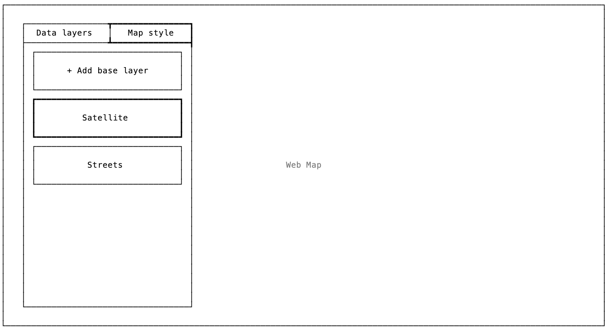
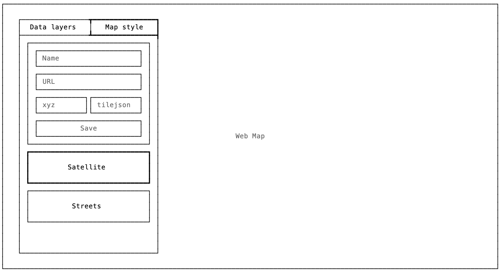
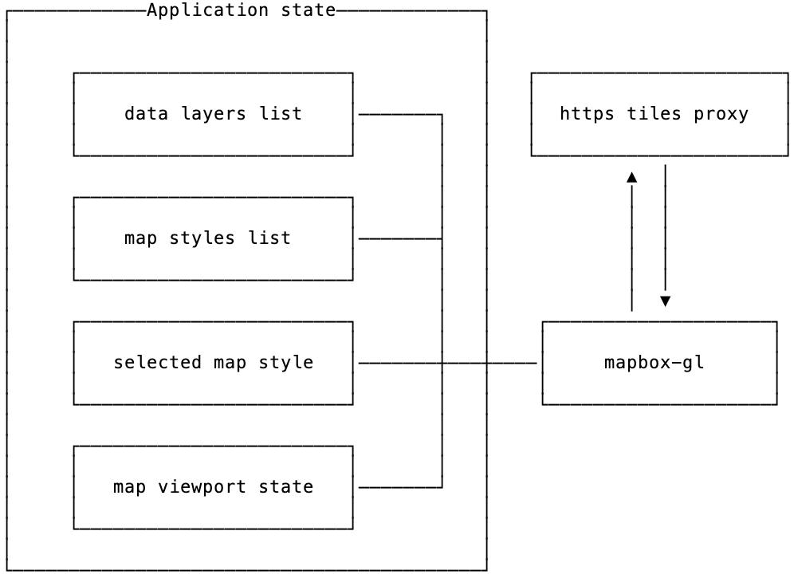
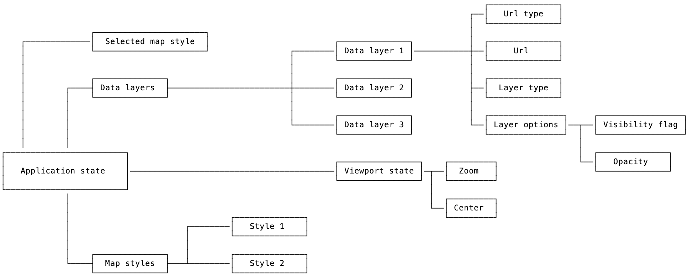

# 🧩 Web Tiles Viewer

## 🧭 Overview

Web Tiles App - web application for viewing satellite data in raster and vector format.

### 🎯 Target audience

This application can be useful both for individual users-cartographers, to view satellite data available via the XYZ/TMS protocols, and for companies that need to visualize their data for their users and customers.

### ⚙️ Functionally

The application contains a full-screen web map and a control panel for data layers, the user can add / remove data layers, as well as change the base map background. It is also possible to pass the configuration of the displayed layers when opening the application by link, in the url parameters, this will allow you to create static links for viewing.

## 📝 Development plan

### Defining the stack

- **Next.js** - `ssr` will not be used in this case, because web maps are incompatible with it, but it is very useful to be able to easily and quickly configure the api, it is also useful for proxying requests to tiles, if the user, for example, specifies an `http` link, this would be a problem if you try to use such a link, because the web browser, `google chrome`, for example, prohibits data from non - `http` resources, while our site uses `https`
- **Typescript** - strong typing will help to minimize the number of possible errors in the development process
- **Blueprint.js** - a convenient and functional set of components for `React`
- **mapbox-gl** - when choosing a library for a web map, I had to choose between `open-source` solutions and `mapbox-gl` [recently not open-source](https://wptavern.com/mapbox-gl-js-is-no-longer-open-source), why the 'mapbox-gl' library continues to evolve and has a set of pretty styles available only with `accessToken`, as well as there are flexible options for customizing the display of vector data. As an alternative, I considered: [maplibre-gl](https://github.com/malibu/malibu-gl-js), open-source fork `mapbox-gl` and `openlayers`. Mapbox-gl has a fairly generous free tier, because in the near future there will be no big traffic for this project, although who knows 😏
- **tailwindcss** - in addition to the wonderful `blueprint.js`, I wanted to be able to quickly and flexibly customize the styles and position our components,`tailwindcss` is perfect for these purposes, they do not conflict with each other as far as I know

### 🖥️ Mockup plan

#### **Initial screen**

Main elements:

- Full screen web map
- Sidebar for managing layers, it contains tabs:
  - Data layers - contains a list of vector/raster layers displayed on the map with the ability to customize their display, add and remove layers
  - Map style - contains a list of map styles available for display, the user can change the current style or add his own

#### New data layer form

New data layer form contains:

- **Layer name** - optional
- **Layer type** - [векторный](https://docs.mapbox.com/vector-tiles/reference/) или растровый
- **URL** - url слоя
- **URL type** - [tile url template](https://mapbox.github.io/mapbox-gl-native/macos/0.5.0/tile-url-templates.html) or [tilejson url](https://docs.mapbox.com/help/glossary/tilejson/)

#### Map style tab

On the map style control tab, the available styles are displayed, the user can see the current active style, switch it, or add a new one

#### New map style form

The form for adding a base layer is similar to the form for adding a data layer

## 🔄 Data flow chart

### 🏫 App architecture overview

The key component of the application is the state object that is planned to be implemented using the `XState` library

- **Application state** will store information about added data layers and map styles
- **`mapbox-gl`** has its own internal state, which describes the current viewport of the map and the configuration of the data layers and themap style
- **https tiles prox** will proxy http requests to tiles as https, which will allow the user to use http links to data layers, this will be useful because it is not always possible to use an https link, for example, if the user has a local [tile-server](https://www.geofabrik.de/maps/tiles.html) running

### 🔎 Application state in details

Let's take a closer look at the state of the application:

- **Data layer** includes
  - **Url** - link to the data layer, more about [slippy maps](https://developers.planet.com/tutorials/slippy-maps-101/) and about [tilesets](https: // docs. mapbox.com/help/glossary/tileset/)
  - **Url type** - 2 types of url are accepted:
    - [tile url template](https://mapbox.github.io/mapbox-gl-native/macos/0.5.0/tile-url-templates.html)
    - [tilejson url](https://docs.mapbox.com/help/glossary/tilejson/)
  - **Layer options**
    - **Visibility flag** - takes values 0 or 1, if 0 is set then the layer is not displayed and vice versa
    - **Opacity** - the transparency value of the layer, takes values from 0 to 1 where 0 - the layer is completely transparent
  - **Layer type** can be either `vector` or `raster`

## 💬 User stories

What I love about user stories is that in the process of creating them, we can discover new useful features that we might have missed

As I said before there is two types of users

- Cartographers - we will call them `core users`
- Companies - we will call them `company users`

Let's assume some user stories for them

> As a `core user`
>
> I want to add data layers to the web map
>
> To be able to view them

> As a `core user`
>
> I want to be able change visibility and opacity of data layers
>
> To configure the appropriate display mode for data layers

> As a `core user`
>
> I want to be able change map style
>
> To choose the most suitable layout for web map

> As a `core user`
>
> I want to share my visualization
>
> To be able to show it to others or save it as static link

> As a `company user`
>
> I want to open the `Web Tiles Viewer` with predefined config
>
> To create direct links to view my data
